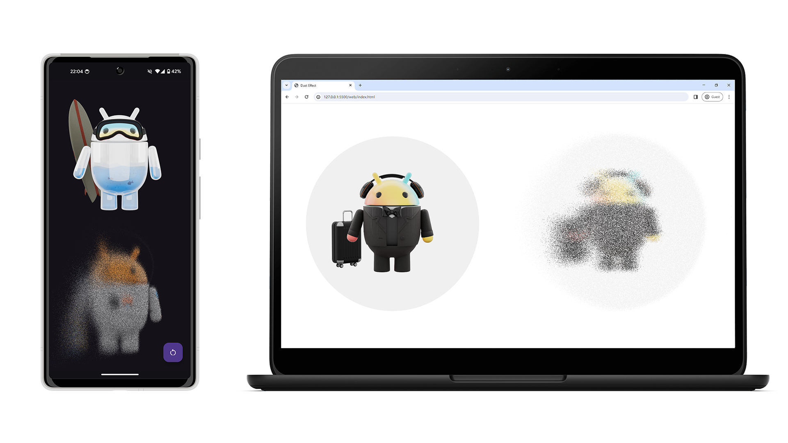

# OpenGL Dust Effect

A project to demonstrate the implementation of the UI-element "disintegration" effect (aka "Thanos"/Dust) on different platforms (Android, Web) using OpenGL. The project is not a library, but only demonstrates one of the possible solutions in educational purposes. You can find a more detailed description for each of the supported platforms in its own README ([Android](android/README.md), [Web](web/README.md)).

## License

    Copyright 2024 Alexander Yuzefovich.

    Licensed under the Apache License, Version 2.0 (the "License");
    you may not use this file except in compliance with the License.
    You may obtain a copy of the License at

    http://www.apache.org/licenses/LICENSE-2.0

    Unless required by applicable law or agreed to in writing, software
    distributed under the License is distributed on an "AS IS" BASIS,
    WITHOUT WARRANTIES OR CONDITIONS OF ANY KIND, either express or implied.
    See the License for the specific language governing permissions and
    limitations under the License.