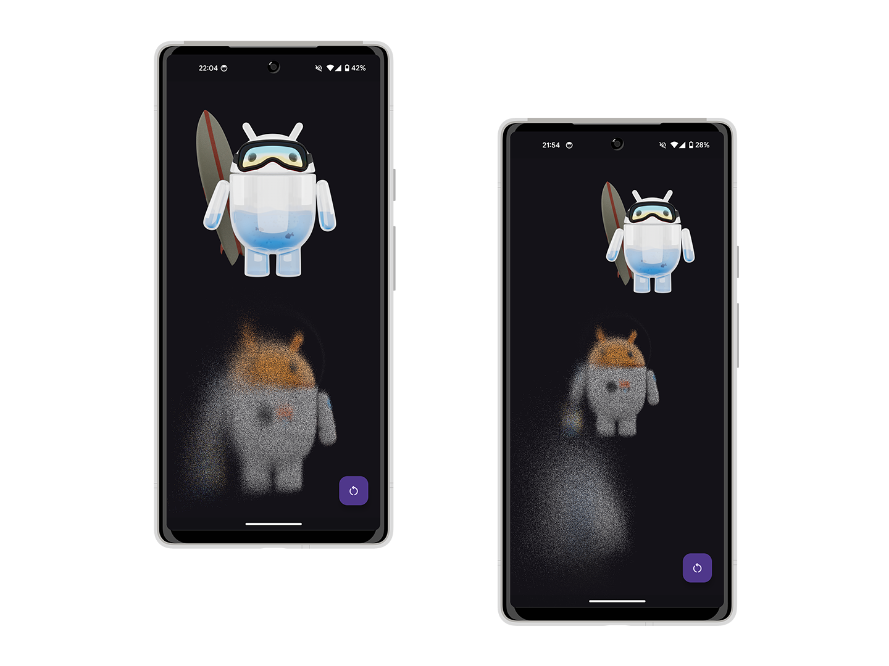

# Dust Effect for Android (OpenGL)

This is a simple showcase of how the UI-element (e.g. *View*) "disintegration" effect (aka "Thanos"/Dust) can be implemented using OpenGL on Android.

## Usage

The project contains two modules:
- `sample` - A simple app to demonstrate the effect in action and how to use it.
- `dust-effect` - The implementation of the effect: `DustEffectRenderer` + shaders.

When using a ready-made implementation, you can use these two methods from `DustEffectRenderer` for customization:
- `setDuration(long duration)` - Set the duration of the animation in milliseconds.
- `setParticleSize(int particleSize)` - Set the particle size in pixels.

Play around with these values to get different look that most fit to your needs. The particle size should be selected according to the performance of the device: the more performant the device, the smaller the particles can be. There is an example of the effect with `particleSize` set to **1** , `duration` set to **1800** and sample app running on real **Pixel 5a (Android 14)**:

Since the project was created mostly for educational purposes, one of the goal was to support animation on old devices (starting from Android 4.4 and below). For this reason, OpenGL ES 2.0 is used instead of newer versions, which in theory allows to run the project on devices with Android starting from 2.2 (API 8). The minimum API version on which I managed to run and test the sample app with the current set of libraries (Appcompat, MDC) is 15 (Android 4.0.3).

## License

    Copyright 2024 Alexander Yuzefovich.

    Licensed under the Apache License, Version 2.0 (the "License");
    you may not use this file except in compliance with the License.
    You may obtain a copy of the License at

    http://www.apache.org/licenses/LICENSE-2.0

    Unless required by applicable law or agreed to in writing, software
    distributed under the License is distributed on an "AS IS" BASIS,
    WITHOUT WARRANTIES OR CONDITIONS OF ANY KIND, either express or implied.
    See the License for the specific language governing permissions and
    limitations under the License.