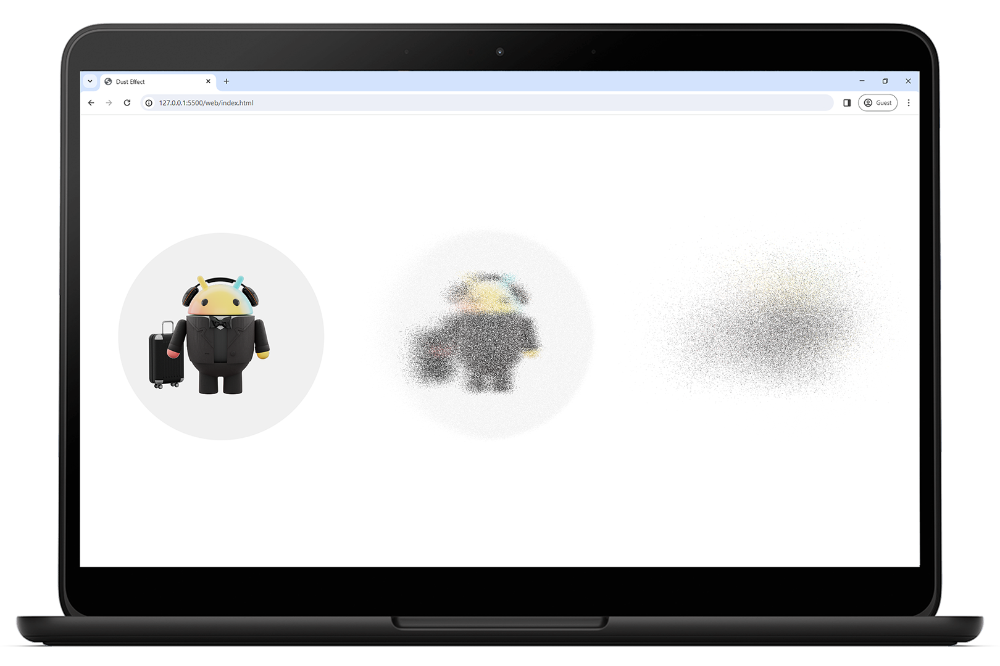

# Dust Effect for Web (WebGL)

This is a simple showcase of how the UI-element (e.g. *div*) "disintegration" effect (aka "Thanos"/Dust) can be implemented using OpenGL on the Web (WebGL).

## How to run

The shader code in the project is loaded from files, so just running `index.html` won't work because of the CORS error. To run the project you will need a simple server: you may use a [Live Server](https://marketplace.visualstudio.com/items?itemName=ritwickdey.LiveServer) extension for VS Code. Just install the extension and click *Go Live*.

## Usage

There are two main parameters placed at the top of `index.js` file:
- `duration` - Total duration of the Dust Effect animation in milliseconds.
- `particleSize` - The size of the particle in pixels.

Play around with these values to get different look that most fit to your needs. When using small particle sizes, it is recommended to enable hardware acceleration in the browser. There is an example of the effect with `particleSize` set to **1** (hardware acceleration is enabled) and `duration` set to **3600** and **18000**:

## License

    Copyright 2024 Alexander Yuzefovich.

    Licensed under the Apache License, Version 2.0 (the "License");
    you may not use this file except in compliance with the License.
    You may obtain a copy of the License at

    http://www.apache.org/licenses/LICENSE-2.0

    Unless required by applicable law or agreed to in writing, software
    distributed under the License is distributed on an "AS IS" BASIS,
    WITHOUT WARRANTIES OR CONDITIONS OF ANY KIND, either express or implied.
    See the License for the specific language governing permissions and
    limitations under the License.